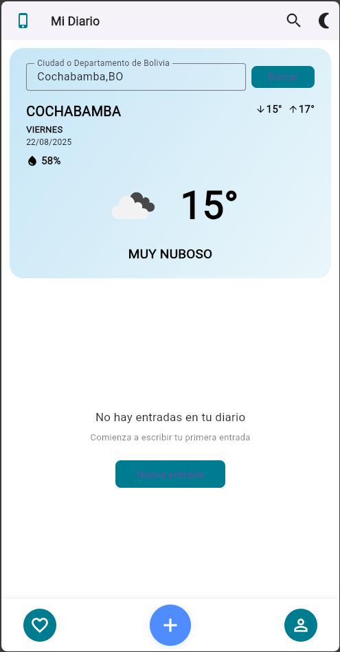
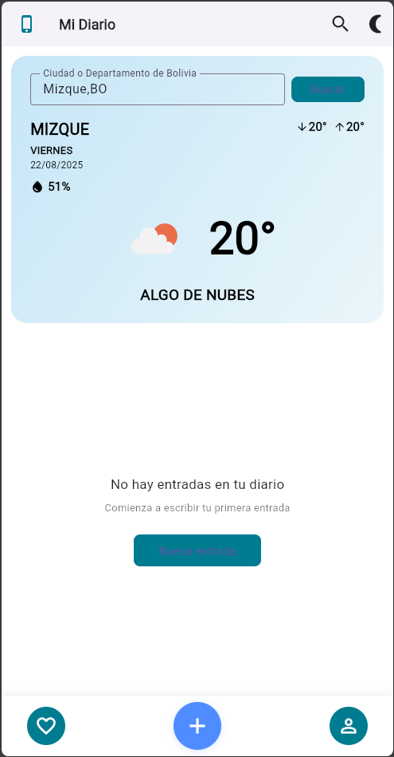

# Diary Flutter App

Este proyecto es una aplicación de diario personal desarrollada en Flutter.

## Componente de Clima

La aplicación incluye un componente de clima minimalista y atractivo que permite al usuario consultar el clima actual de cualquier ciudad o departamento de Bolivia. El usuario puede escribir el nombre de la ciudad y ver la información meteorológica en tiempo real, incluyendo temperatura, humedad, descripción y un ícono representativo. Si ocurre un error (por ejemplo, ciudad no encontrada), se muestra un mensaje claro al usuario.

### Ejemplo de uso del clima

	
	

---
